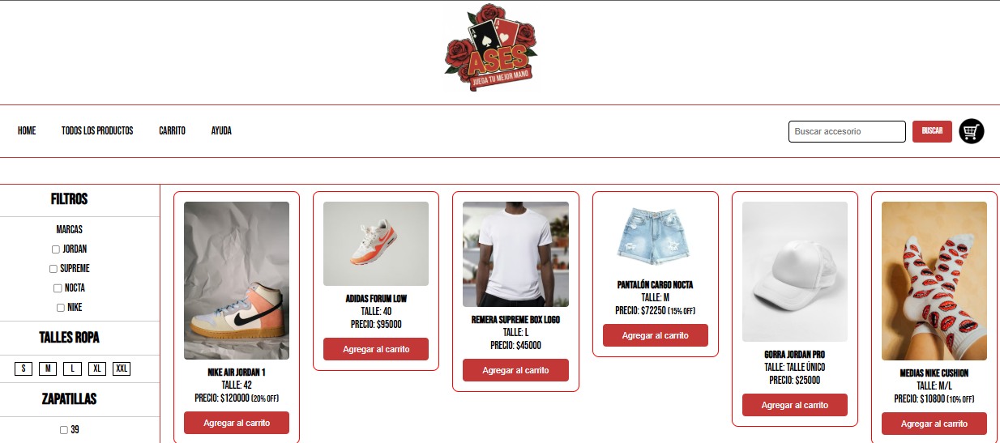
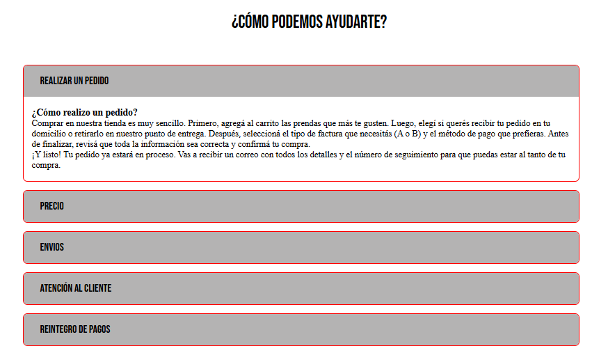
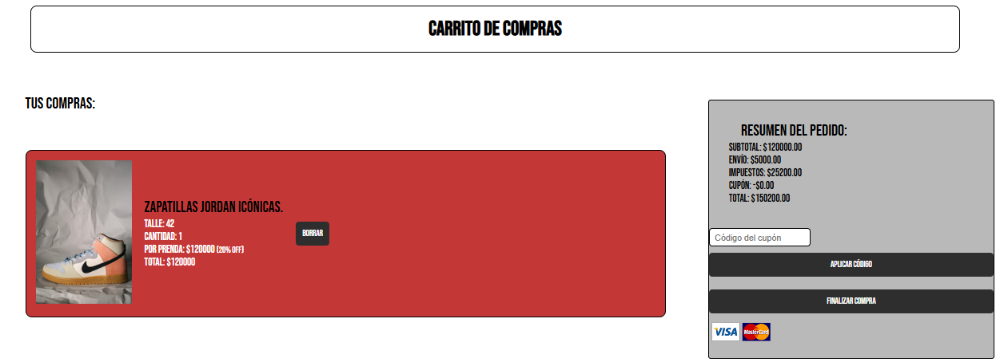
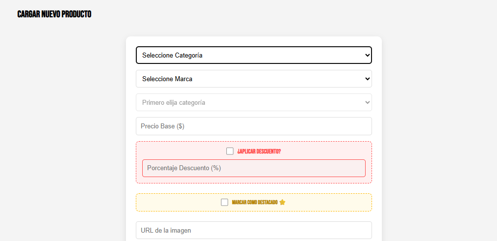
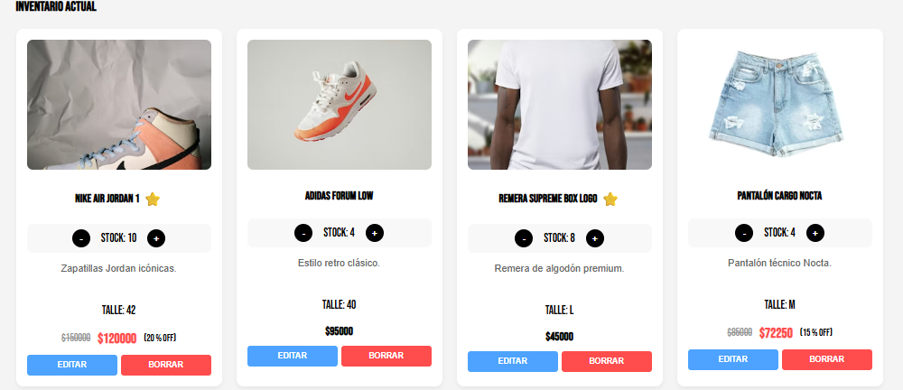
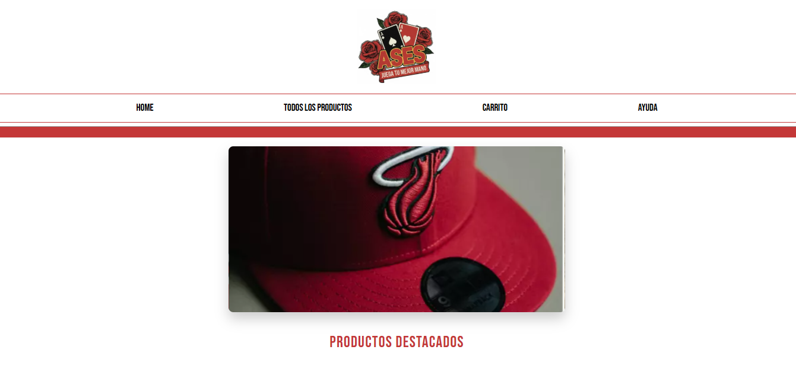

Descripcion del proyecto: Nuestro proyecto consta de la realizacion de una tienda e-commerce de un emprendimiento de venta de ropa, de gorras y de accesorios.
Empezamos primero diagramando como queriamos que se estructure la pagina, que queriamos que se muestre y las funcionalidades que iba a tener cada una. Luego de ya haber definido como iban a hacer las paginas nos decidimos dividir las distintas partes de la misma entre los integrantes del grupo.

Las paginas a realizar eran: El apartado de home que es el principal, la galeria, el carrito de compras, el apartado de ayuda y el crud que es donde se cargan los productos ingresados.

En el home la instencion era mostrar un carrusel los productos que estaran a la venta, los productos destacados, las ofertas y los productos disponibles.

En la galeria queriamos mostrar detalladamente todos los productos disponibles de la pagina que puedan ver el precio, el stock, el tipo de articulo que es, el talle y el producto. Tambien a un costado se va mostrar un menu de filtros en el que puedes seleccionar la marca del producto, el talle, numero de calzado, talle de accesorio, un rango para seleccionar el producto mas barato y el mas caro, el tipo de producto, el descuento y si esta en stock.

El carrito de compras va a mostrar cuando el usuario haya seleccionado para comprar un producto en el apartado de Galeria, en el cual se le mostrara el precio, las cantidades y esta la opcion de poder quitar productos en caso de que el usuario no quiera comprarlo.

El apartado de ayuda muestra toda la informacion acerca de la tienda, envios, politicas de devolucion, ubicacion y metodos de pago. Tambien posee un contacto de correo electronico y numero telefonico para poder solicitar un reclamo.

En el crud es el sistema de carga y edicion de todos los productos de la tienda, permite introducir la marca, el talle, el precio, el descuento, una descripcion y la cantidad de stock. Todo esto esta pensado para mantener el inventario organizado y optimizar la administracion de la tienda de forma practica y eficiente.

TECNOLOGIAS USADAS
Utilizamos HTML para estructurar todo el contenido de las paginas, luego el CSS para dar estilos y aplicar flex y grid, y por ultimo utilizamos JS para darle funcionalidad a la pagina e hicimos uso de localStorage para cargar los productos en el CRUD.

Utilizamos tambien GitHub para poder trabajar individualmente en ramas y poder ir guardando los avances que fuimos haciendo en nuestras paginas.

Instruccuiones para ejecutarlo

1) Clonar el repositorio mediante este link:
2) Abrir la carpeta de Ases_ros.
3) Ejecutar el archivo index.html en el navegador.

Capturas de pantalla

Galería
Sistema de galería de productos con filtros y barra de búsqueda para facilitar la navegación y encontrar productos rápidamente.

Ayuda
Sección de ayuda con apartados desplegables (collapse/acordeón) donde se muestra información sobre envíos, devoluciones, contacto y métodos de pago.

Carrito
Carrito de compras con visualización de productos seleccionados y finalización de compra.

CRUD - Gestión de Stock
Sistema CRUD para la administración de productos, permitiendo agregar, editar y eliminar elementos del inventario.

Home
Página principal con sección de productos destacados y presentación general de la tienda.

